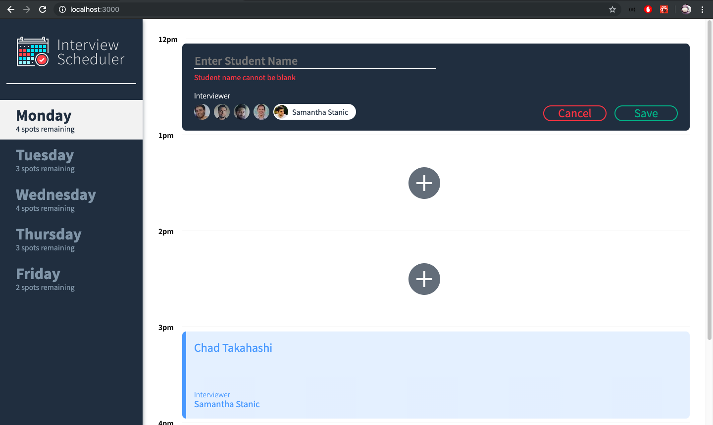
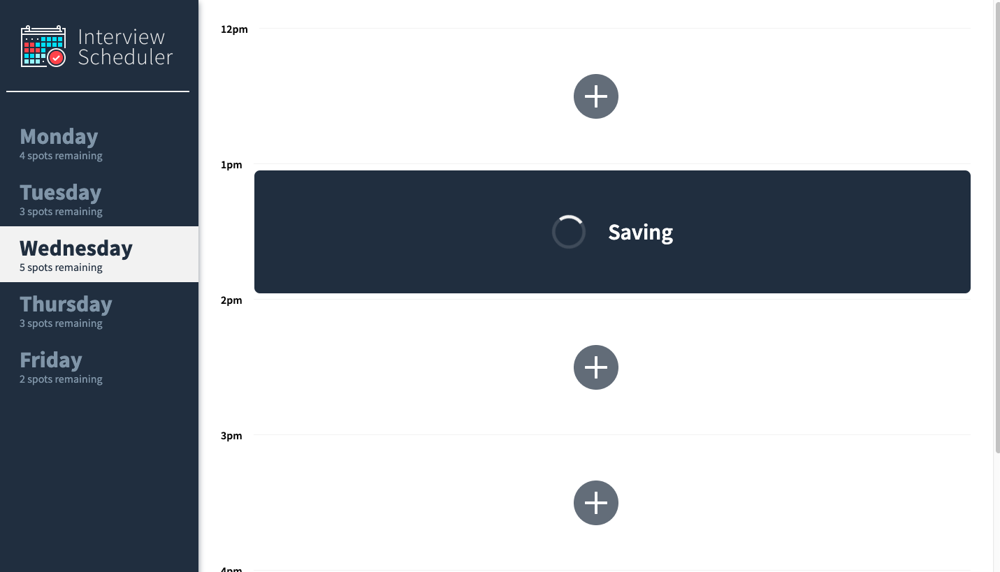
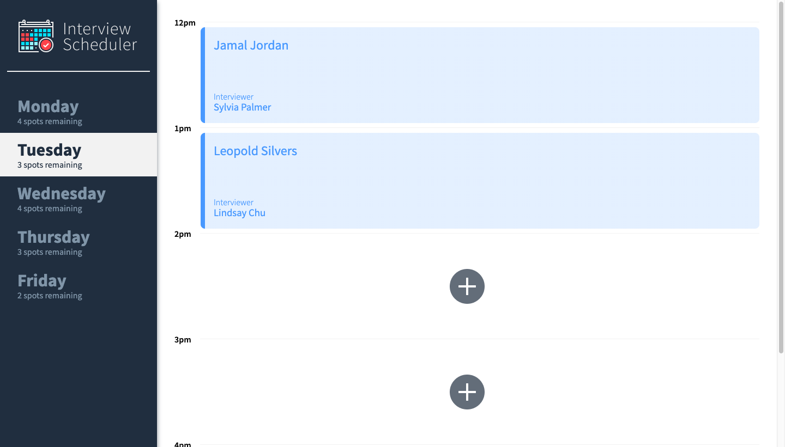
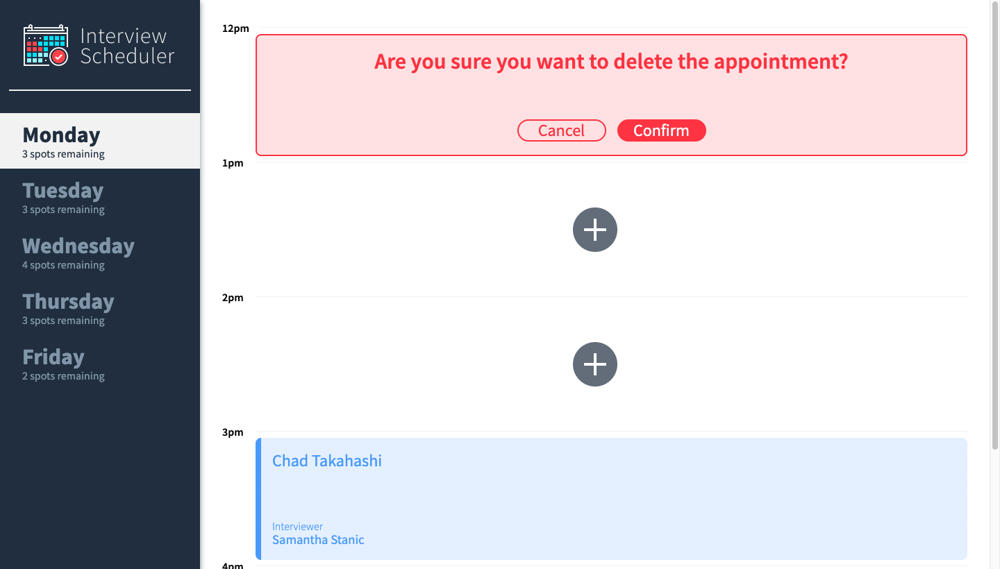
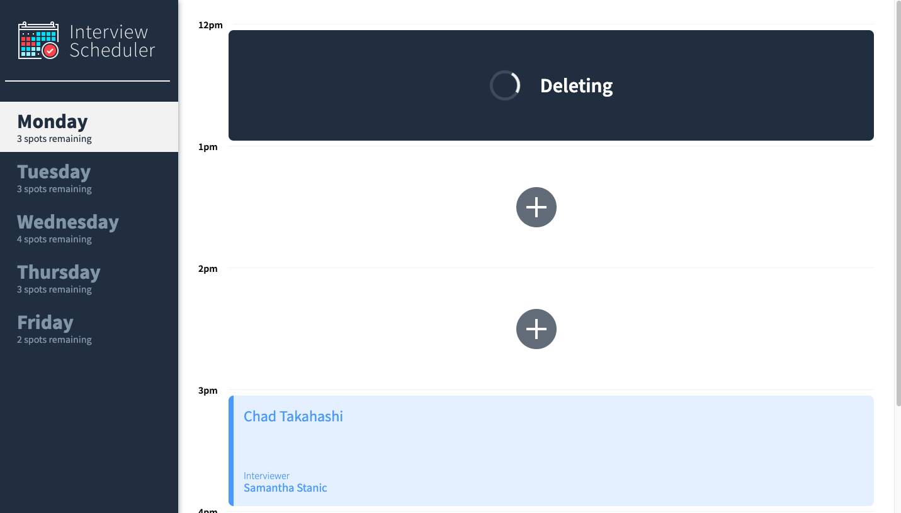
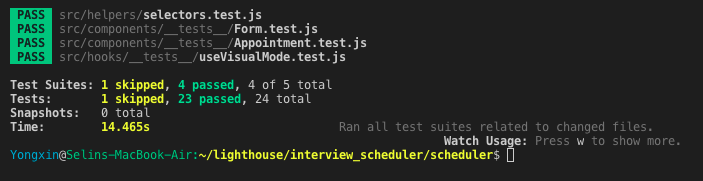
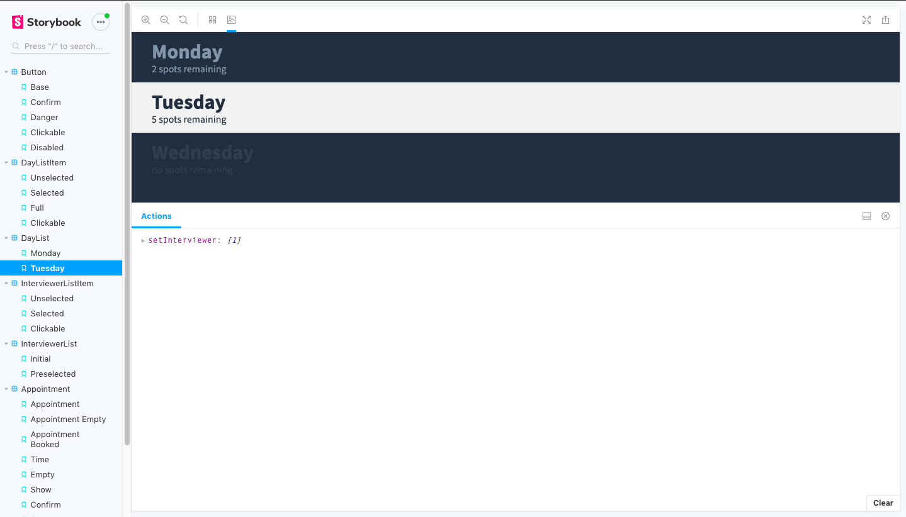

# Interview Scheduler

Interview Scheduler is a single page **React** application that allows users to schedule appointments throughout the day. The page renders a one-week view, with details of each appointment booked for each day of the week.

### **Booking an appointment:**



### **Saving status of a newly booked appointment:**



### **Showing an appointment slot:**



### **Confirm to delete an appointment:**



### **Deleting an appointment:**



### **JEST tests:**



### **Storybook:**



# Setup

### 1. Install dependencies

```sh
npm install
```

### 2. Start Web Server

```sh
npm start
```

### 3. Vist http://localhost:3000 in your browser to view the web page.

# Dependencies

- Axios
- Classnames
- React
- React-dom
- React-scripts
